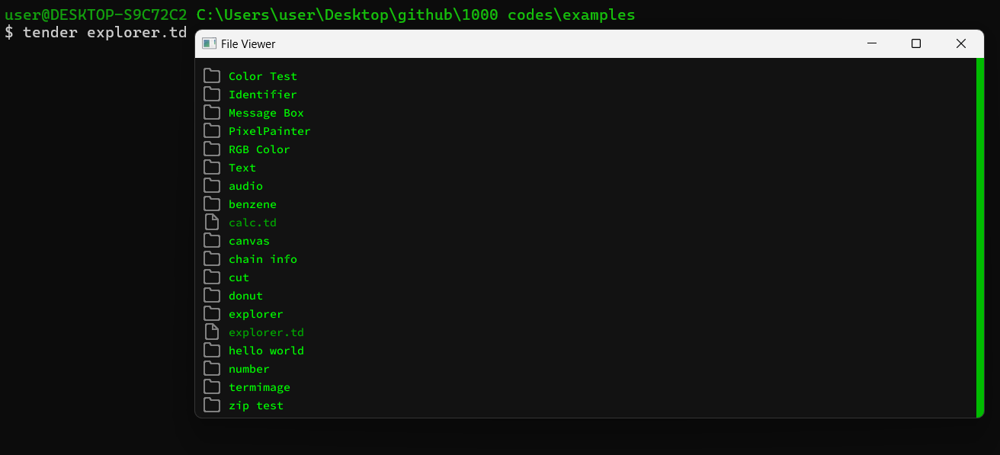

# Tender Explorer

**Tender Explorer** is a graphical file browser built using the [**Tender**](https://github.com/2dprototype/tender). It provides a simple, intuitive interface for navigating and exploring the file system. The explorer displays directories and files with appropriate icons, allows users to scroll through contents, and click to open folders—all within a resizable window.

## **Features**

- **Interactive File Navigation**: Browse directories and view files with folder and file icons.
- **Scrollable Interface**: Use your keyboard or mouse to scroll through long lists of files.
- **Resizable Window**: The UI adjusts dynamically based on the window size.
- **Directory Navigation**: Click on directories to explore deeper into the file structure, and use shortcuts to return to the parent folder.
- **Customizable Icons**: Supports custom icons for files and folders (included by default in the `res` folder).

## **Preview**

Below is a preview of **Tender Explorer** in action:



The interface displays folder and file icons, a scrollbar for easy navigation, and adjusts based on window size for a responsive experience.

## **Getting Started**

To get started with **Tender Explorer**, follow these instructions to install **Tender** and set up the explorer.

### **1. Install Go**

Ensure you have the latest version of **Go** installed on your machine. **Tender** relies on Go, so it must be installed first.

You can download Go from the [official Go website](https://golang.org/).

### **2. Install Tender**

Once Go is installed, you can install **Tender** by running the following command in your terminal:

```bash
go install github.com/2dprototype/tender/cmd/tender@latest
```

Alternatively, you can download precompiled binaries from the [Tender Releases page](https://github.com/2dprototype/tender/releases). Choose the appropriate binary for your operating system and follow the provided installation instructions.

### **3. Clone the Repository**

Clone this repository to your local machine:

```bash
git https://github.com/IHEfty/Tender-Explorer.git
cd Tender-Explorer
```

### **4. Running Tender Explorer**

To start **Tender Explorer**, run the following command:

```bash
tender main.td
```

A window will open, displaying the files and directories in your current working directory. You can use the keyboard and mouse to scroll, navigate into folders, and interact with the UI.

## **Usage**

Once **Tender Explorer** is running, you can perform the following actions:

- **Scroll through files**: Use the `Up Arrow` and `Down Arrow` keys or scroll with the mouse wheel.
- **Open a folder**: Click on any folder name to navigate into it.
- **Return to the parent directory**: Press the `*` key to go back to the previous directory.
- **Resize the window**: The UI automatically adjusts to fit the new window size.

## **Keyboard Shortcuts**

- **Scroll Down**: `Down Arrow (↓)`
- **Scroll Up**: `Up Arrow (↑)`
- **Open Folder**: Click on the folder icon or name.
- **Return to Parent Directory**: Press the `*` key.
  
## **Code Explanation**

**Tender Explorer** is built using the `canvas`, `fs`, `image`, and `path` modules from the **Tender** language.

- **Canvas Rendering**: The file explorer UI is rendered on a canvas using the `draw()` function, which handles drawing file names, icons, and the scrollbar.
- **File System Interaction**: The `fs.readdir()` function is used to read the contents of the current directory, and the results are displayed as a list.
- **Scrolling**: Scroll position is managed by the `scroll_offset` variable, which adjusts the visible portion of the file list based on user input.
- **Directory Navigation**: Clicking on a directory updates the `dir` variable and re-renders the new directory contents.

## **Customization**

You can customize the look and feel of **Tender Explorer** by modifying the icon images (`res/file.svg.png` and `res/folder.svg.png`) or adjusting the canvas drawing logic in the `draw()` function. The icons are drawn dynamically, and you can change colors or font styles in the code.

## **Explore More**

To explore more **Tender** projects and get access to additional code examples, visit the following repository:

[1000+ Codes in Tender](https://github.com/IHEfty/1000-Codes-in-Tender/)

This repository contains a rich collection of Tender-based code samples, ranging from simple applications to complex utilities, allowing you to enhance your understanding of **Tender** and its capabilities.

## **License**
This project is open-source and licensed under the MIT License. You are free to use, modify, and distribute it in your own projects.
For more details, see the [LICENSE](LICENSE) file.
